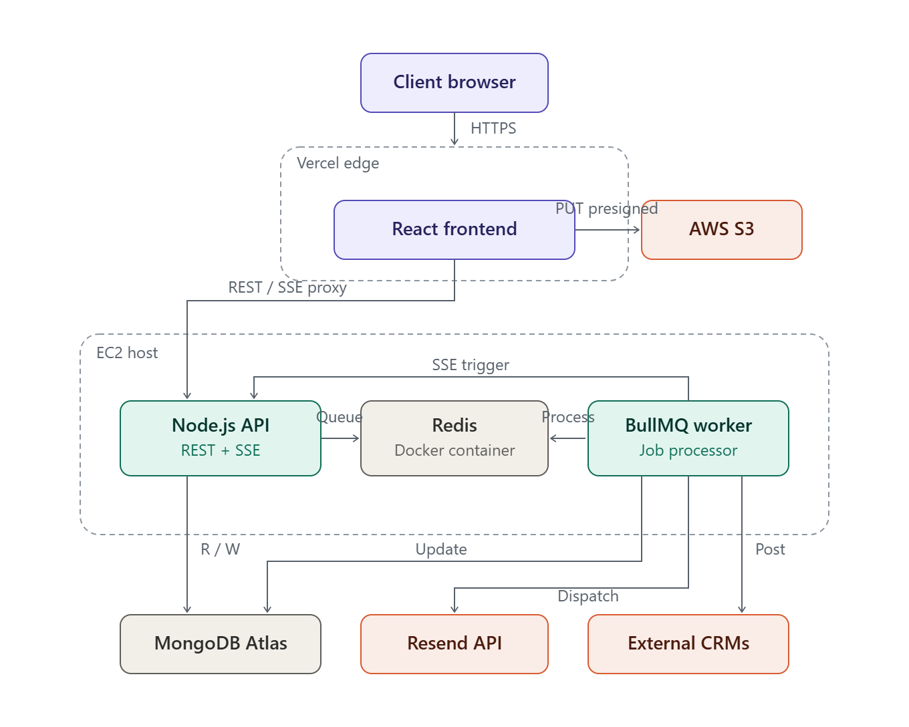

<div align="center">
  
  
  
  
  
  

  <h1>CreditPulse</h1>
  <p><strong>Loan Origination and Underwriting System</strong></p>

  [](https://credit-pulse-xi.vercel.app/)
  [](#)
  [](#)
  [](#)
  [](#)
</div>

---

CreditPulse is a loan application and underwriting system designed around microservice principles. It provides secure applicant submission flows, automated risk scoring, and a real-time portal for underwriters to review and process applications.

## Table of Contents

- [Architecture Overview](#architecture-overview)
- [Core Features](#core-features)
- [System Flow](#system-flow)
- [Technology Stack](#technology-stack)
- [Local Environment Setup](#local-environment-setup)
- [Configuration](#configuration)
- [Deployment](#deployment)
- [API Reference](#api-reference)

---

## Architecture Overview

The system architecture focuses on operational stability and fault tolerance under load:

### 1. Fail-Fast Caching and Rate Limiting
The Node.js API relies on Redis for rate-limiting and short-lived caching. The Redis client is configured with `enableOfflineQueue: false` to ensure the application fails fast during cache outages. Rate limiters are designed to degrade gracefully, allowing core requests to process even if the memory-store connection drops, preventing event loop blocking.

### 2. Event-Driven Background Processing
Asynchronous tasks are managed via **BullMQ** on a containerized Redis instance to decouple heavy operations from the main API thread:
- **Webhooks:** Outbound HTTP requests to external CRMs execute in the background with automatic retries and exponential backoff.
- **Email Delivery:** Transactional notifications are queued and dispatched via Resend.

### 3. Stateless S3 Uploads
Large file uploads (e.g., identity documents, pay slips) are handled client-side via S3 Pre-Signed URLs. The Node.js backend computes a cryptographic signature (HMAC SHA-256) and returns a temporary URL. The client executes a direct `PUT` to the AWS S3 bucket, preventing the API servers from buffering large binary payloads.

### 4. Containerized IPC
Redis runs as a containerized instance alongside the Node.js API and Worker containers on the same Docker bridge network. This reduces inter-process communication (IPC) latency to <1ms compared to external managed caches.

---

## Core Features

- **Role-Based Access Control (RBAC):** Strict permission boundaries between Applicants and Admins.
- **Audit Logging:** Logs state changes (creations, assignments, status updates) to a dedicated collection, rendered as a chronological Activity Timeline in the administrative portal.
- **Risk Scoring Engine:** Evaluates income-to-loan ratios, employment stability, and document completeness to generate automated risk profiles.
- **Authentication:** Utilizes short-lived JWT access tokens, HTTP-only refresh tokens, and Google OAuth 2.0.
- **Real-Time Notifications:** Admin actions trigger background jobs that push updates to the applicant's browser via Server-Sent Events (SSE).
- **Webhooks (HMAC Verified):** Allows administrators to register external endpoints for real-time JSON payloads on loan status changes, authenticated via `x-creditpulse-signature`.

---

## System Flow



---

## Technology Stack

| Component          | Technology               | Description                                              |
| :----------------- | :----------------------- | :------------------------------------------------------- |
| **Frontend**       | React, Vite, TailwindCSS | Client-side application bundle.                          |
| **Backend**        | Node.js, Express         | REST API and WebSocket/SSE provider.                     |
| **Language**       | TypeScript               | Strict typing across the stack.                          |
| **Database**       | MongoDB Atlas            | Primary operational datastore.                           |
| **Message Broker** | Redis, BullMQ            | Job queuing and rate limiting.                           |
| **Object Storage** | AWS S3                   | Secure storage for applicant documents.                  |
| **Email Service**  | Resend                   | Transactional email provider.                            |
| **Infrastructure** | Docker, AWS EC2, Vercel  | Containerized backend services and edge-cached frontend. |

---

## Local Environment Setup

### Prerequisites
- Node.js 18+
- Docker and Docker Compose
- MongoDB instance (Local or Atlas)
- AWS IAM Credentials (for S3)
- Google OAuth 2.0 Credentials
- Resend API Key

### 1. Repository Setup
```bash
git clone https://github.com/SKD151105/CreditPulse.git
cd CreditPulse

# Install API dependencies
cd server && npm install

# Install UI dependencies
cd ../client && npm install
```

### 2. Execution via Docker Compose
The local development environment uses Docker Compose to orchestrate the API, Worker, and Redis containers.

```bash
# Start backend services
cd server
docker compose up -d

# Start frontend development server
cd ../client
npm run dev
```

---

## Configuration

### API Environment (`server/.env`)

| Variable                | Description                                        |
| :---------------------- | :------------------------------------------------- |
| `PORT`                  | API port (default: 5000)                           |
| `NODE_ENV`              | `development` or `production`                      |
| `MONGO_URI`             | MongoDB connection string                          |
| `REDIS_URI`             | Redis connection string (`redis://localhost:6379`) |
| `JWT_ACCESS_SECRET`     | Secret for signing Access Tokens                   |
| `JWT_REFRESH_SECRET`    | Secret for signing Refresh Tokens                  |
| `AWS_REGION`            | AWS Region for S3                                  |
| `AWS_ACCESS_KEY_ID`     | AWS IAM Access Key                                 |
| `AWS_SECRET_ACCESS_KEY` | AWS IAM Secret Key                                 |
| `S3_BUCKET_NAME`        | AWS S3 Bucket Name                                 |
| `GOOGLE_CLIENT_ID`      | Google OAuth Client ID                             |
| `GOOGLE_CLIENT_SECRET`  | Google OAuth Client Secret                         |
| `RESEND_API_KEY`        | Resend API Key                                     |
| `CLIENT_URL`            | Allowed CORS origin                                |
| `SUPER_ADMIN_SECRET`    | Passphrase for Admin promotion                     |
| `WEBHOOK_SECRET`        | Secret used to sign HMAC webhook payloads          |

### Client Environment (`client/.env`)

| Variable                | Description            |
| :---------------------- | :--------------------- |
| `VITE_GOOGLE_CLIENT_ID` | Google OAuth Client ID |
| `VITE_API_URL`          | Target API URL         |

---

## Deployment

Continuous Integration and Deployment are managed via GitHub Actions (`.github/workflows/deploy.yml`).

1. **Build Phase:** Code pushed to `main` triggers a multi-stage Docker build. The resulting image is pushed to the GitHub Container Registry (`ghcr.io`).
2. **Provisioning:** The pipeline connects to the AWS EC2 host via SSH, writing necessary environment variables from GitHub Secrets.
3. **Rollout:** The host pulls the latest image and executes `docker compose up -d` to recreate containers.

---

## API Reference

### Authentication
| Method | Endpoint             | Description          | Auth |
| :----- | :------------------- | :------------------- | :--- |
| `POST` | `/api/auth/register` | Register applicant   | No   |
| `POST` | `/api/auth/login`    | Email/password login | No   |
| `POST` | `/api/auth/google`   | Google OAuth         | No   |
| `POST` | `/api/auth/refresh`  | Rotate tokens        | No   |
| `POST` | `/api/auth/logout`   | Invalidate session   | Yes  |

### Loan Operations
| Method  | Endpoint                | Description              | Auth |
| :------ | :---------------------- | :----------------------- | :--- |
| `POST`  | `/api/loans`            | Create draft application | Yes  |
| `GET`   | `/api/loans`            | List applications        | Yes  |
| `GET`   | `/api/loans/:id`        | Get application details  | Yes  |
| `PATCH` | `/api/loans/:id`        | Update draft             | Yes  |
| `POST`  | `/api/loans/:id/submit` | Submit application       | Yes  |

### Administrative & System
| Method  | Endpoint                          | Description                      | Auth        |
| :------ | :-------------------------------- | :------------------------------- | :---------- |
| `GET`   | `/api/admin/loans`                | List all applications            | Yes (Admin) |
| `GET`   | `/api/admin/loans/:id/audit-logs` | Retrieve application audit trail | Yes (Admin) |
| `PATCH` | `/api/admin/loans/:id/assign`     | Assign application               | Yes (Admin) |
| `PATCH` | `/api/admin/loans/:id/status`     | Update application status        | Yes (Admin) |
| `GET`   | `/api/webhooks`                   | List webhook configurations      | Yes (Admin) |
| `POST`  | `/api/webhooks`                   | Register webhook endpoint        | Yes (Admin) |

---

## License

Licensed under the MIT License - see the [LICENSE](LICENSE) file for details.
