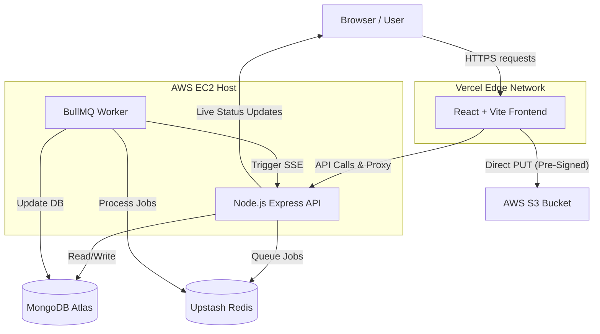

<div align="center">
  <h1>⚡ CreditPulse</h1>
  <p><strong>A Next-Generation Loan Underwriter Platform</strong></p>

  [](https://credit-pulse-xi.vercel.app/)
  [](#)
  [](#)
  [](#)
  [](#)
  [](https://opensource.org/licenses/MIT)
</div>

---

CreditPulse is a comprehensive, scalable, and secure loan application and underwriting platform. It enables applicants to submit loan requests and upload supporting documents securely, while empowering underwriters (admins) to review, approve, or reject applications with real-time feedback loops.

## 📋 Table of Contents

- [Features](#-features)
- [Architecture](#-architecture)
- [Tech Stack](#-tech-stack)
- [Getting Started (Local Development)](#-getting-started-local-development)
- [Environment Variables](#-environment-variables)
- [CI/CD Pipeline](#-cicd-pipeline)
- [API Endpoints](#-api-endpoints)
- [License](#-license)

---

## ✨ Features

- 🔐 **Role-Based Access Control (RBAC):** Distinct experiences and permissions for `Applicants` and `Admins` (Underwriters).
- 🛡️ **Secure Authentication:** JWT-based authentication featuring short-lived access tokens and secure refresh token rotation, alongside seamless **Google OAuth 2.0** integration.
- 📄 **Stateless S3 Document Uploads:** High-performance, direct-to-browser S3 file uploads using Pre-Signed URLs. Eliminates Node.js bottlenecks by bypassing the backend server entirely during large file transfers.
- ⚡ **Event-Driven Real-Time Notifications:** Admin actions trigger serverless background jobs, which instantly push live status updates to the applicant's browser via Server-Sent Events (SSE).
- 🐳 **Dockerized Microservices:** Clean, multi-stage Docker builds separating the core API server from the background worker queue.
- 🚀 **Automated CI/CD:** Fully automated GitHub Actions pipeline that builds, registers, and deploys the latest containers directly to AWS EC2 via `docker compose`.

---

## 🏗 Architecture

CreditPulse utilizes a decoupled, event-driven architecture designed for high availability and performance.



---

## 💻 Tech Stack

| Layer | Technology | Purpose |
| :--- | :--- | :--- |
| **Frontend** | React + Vite | Blazing fast client-side application with optimized builds. |
| **Backend API** | Node.js + Express | Highly scalable runtime for handling REST API requests. |
| **Language** | TypeScript | End-to-end type safety across the entire stack. |
| **Database** | MongoDB Atlas | Managed NoSQL database (M0 Free Tier) for flexible document storage. |
| **Queue & Cache**| Upstash Redis + BullMQ | Serverless Redis instance managing asynchronous background jobs. |
| **Storage** | AWS S3 | Secure, scalable object storage for applicant documents. |
| **Real-time** | Server-Sent Events (SSE) | Lightweight, unidirectional live event streaming to connected clients. |
| **Hosting** | Vercel & AWS EC2 | Vercel for frontend CDN; EC2 for running Dockerized backend services. |

---

## 🚀 Getting Started (Local Development)

Follow these steps to run CreditPulse on your local machine.

### Prerequisites
- Node.js (v18+)
- Docker & Docker Compose
- A MongoDB Atlas cluster (or local MongoDB)
- An AWS Account (for S3 and IAM credentials)
- Google Cloud Console Project (for OAuth credentials)

### 1. Clone the repository
```bash
git clone https://github.com/SKD151105/CreditPulse.git
cd CreditPulse
```

### 2. Install Dependencies
Install dependencies for both the frontend and backend workspaces:
```bash
# Install backend dependencies
cd server
npm install

# Install frontend dependencies
cd ../client
npm install
```

### 3. Configure Environment Variables
Create the necessary `.env` files for both the frontend and backend. See the [Environment Variables](#-environment-variables) section below for detailed tables.

### 4. Run Locally
You can run the full stack locally using the Vite dev server and Docker Compose.

```bash
# Start backend (API, Worker, Redis, MongoDB if configured)
cd server
docker compose up -d

# Start frontend
cd ../client
npm run dev
```

---

## ⚙️ Environment Variables

### Backend (`server/.env`)
The backend requires the following environment variables. **Do not commit actual secrets to version control.**

| Name | Description | Example |
| :--- | :--- | :--- |
| `PORT` | The port the API runs on | `5000` |
| `NODE_ENV` | Environment state | `development` / `production` |
| `MONGO_URI` | MongoDB Connection String | `mongodb+srv://...` |
| `REDIS_URI` | Upstash Redis Connection String | `rediss://...` |
| `JWT_ACCESS_SECRET` | Secret key for signing Access Tokens | `your_super_secret_key` |
| `JWT_REFRESH_SECRET`| Secret key for signing Refresh Tokens | `another_super_secret_key` |
| `JWT_ACCESS_EXPIRES_IN`| Lifespan of the Access Token | `15m` |
| `JWT_REFRESH_EXPIRES_IN`| Lifespan of the Refresh Token | `7d` |
| `AWS_REGION` | AWS Region for the S3 Bucket | `ap-south-1` |
| `AWS_ACCESS_KEY_ID` | AWS IAM Access Key | `AKIA...` |
| `AWS_SECRET_ACCESS_KEY`| AWS IAM Secret Key | `secret...` |
| `S3_BUCKET_NAME` | Name of the AWS S3 Bucket | `creditpulse-docs` |
| `GOOGLE_CLIENT_ID` | Google OAuth 2.0 Client ID | `123-abc.apps.google...` |
| `GOOGLE_CLIENT_SECRET`| Google OAuth 2.0 Client Secret | `GOCSPX-...` |
| `CLIENT_URL` | Allowed CORS origin (Frontend URL) | `http://localhost:5173` |

### Frontend (`client/.env`)
Create a `.env` file in the `client/` directory to configure the React application.

| Name | Description | Example |
| :--- | :--- | :--- |
| `VITE_GOOGLE_CLIENT_ID` | Google OAuth 2.0 Client ID for the React app | `123-abc.apps.googleusercontent.com` |
| `VITE_API_URL` | (Optional) Backend API URL. Defaults to `/api` proxy. | `http://localhost:5000/api` |

---

## 🔄 CI/CD Pipeline

CreditPulse utilizes a fully automated CI/CD pipeline built with **GitHub Actions**. Whenever code is pushed to the `main` branch, the following workflow (`.github/workflows/deploy.yml`) is triggered:

1. **Build & Push:** The pipeline checks out the code, logs into the GitHub Container Registry (`ghcr.io`), builds the multi-stage Docker image for the backend, and pushes it to the registry.
2. **Dynamic Configuration:** Uses `appleboy/ssh-action` to securely SSH into the AWS EC2 production server. It dynamically generates the `.env.prod` and `docker-compose.prod.yml` files using GitHub Secrets.
3. **Zero-Downtime Deployment:** The EC2 server pulls the latest Docker image from GHCR and executes `docker compose up -d` to seamlessly recreate and restart the API and Worker containers.

---

## 🛣 API Endpoints

### 🔐 Auth Routes
| Method | Endpoint | Description | Auth Required |
| :--- | :--- | :--- | :--- |
| `POST` | `/api/auth/register` | Register a new applicant | No |
| `POST` | `/api/auth/login` | Login with email/password | No |
| `POST` | `/api/auth/google` | Authenticate via Google OAuth | No |
| `POST` | `/api/auth/refresh` | Rotate JWT refresh tokens | No |
| `POST` | `/api/auth/logout` | Invalidate refresh tokens | Yes |
| `GET`  | `/api/auth/me` | Get current user profile | Yes |

### 📝 Loan Application Routes
| Method | Endpoint | Description | Auth Required |
| :--- | :--- | :--- | :--- |
| `POST` | `/api/loans` | Create a new draft loan application | Yes |
| `GET`  | `/api/loans` | Get all loans (Applicant sees own; Admin sees all) | Yes |
| `GET`  | `/api/loans/:id` | Get specific loan details | Yes |
| `PATCH`| `/api/loans/:id` | Update a draft loan application | Yes |
| `POST` | `/api/loans/:id/submit`| Submit a completed application | Yes |
| `GET`  | `/api/loans/upload-url`| Get S3 Pre-signed URL for document upload | Yes |

### 👑 Admin Routes
| Method | Endpoint | Description | Auth Required |
| :--- | :--- | :--- | :--- |
| `GET`  | `/api/admin/metrics` | Get platform metrics & statistics | Yes (Admin) |
| `PATCH`| `/api/admin/loans/:id/status` | Approve or Reject a loan | Yes (Admin) |

### ⚡ Notifications
| Method | Endpoint | Description | Auth Required |
| :--- | :--- | :--- | :--- |
| `GET`  | `/api/notifications/stream` | Subscribe to live Server-Sent Events | Yes |
| `GET`  | `/api/notifications` | Fetch historical notifications | Yes |
| `PATCH`| `/api/notifications/:id/read` | Mark a notification as read | Yes |

---

## 📄 License

This project is licensed under the MIT License - see the [LICENSE](LICENSE) file for details.
