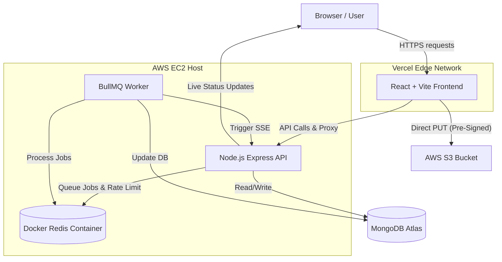

<div align="center">
  <h1>CreditPulse</h1>
  <p><strong>Enterprise-Grade Loan Origination and Underwriting Platform</strong></p>

  [](https://credit-pulse-xi.vercel.app/)
  [](#)
  [](#)
  [](#)
  [](#)
  [](#)
</div>

---

CreditPulse is a scalable, secure, and highly-available loan application and underwriting system. Built with modern microservice principles, it enables applicants to submit loan requests and upload supporting documentation securely, while providing underwriters with a real-time portal to review, score, and process applications.

## Table of Contents

- [Engineering Decisions & Architecture Highlights](#engineering-decisions--architecture-highlights)
- [Features](#features)
- [Architecture Flow](#architecture-flow)
- [Tech Stack](#tech-stack)
- [Local Development Setup](#local-development-setup)
- [Environment Variables](#environment-variables)
- [CI/CD Pipeline](#cicd-pipeline)
- [API Endpoints](#api-endpoints)

---

## Engineering Decisions & Architecture Highlights

This project was built with a strong emphasis on reliability, performance, and operational security. Several key architectural decisions were made to ensure the platform remains stable under load and network failure:

### 1. Fail-Fast Infrastructure and Graceful Degradation
The backend incorporates a highly resilient rate-limiting and caching strategy. By configuring the Node.js Redis client to bypass offline queues (`enableOfflineQueue: false`), the application will "fail fast" if the Redis instance becomes unavailable. Furthermore, the rate-limiter is designed to gracefully catch cache-layer failures, allowing critical requests to bypass the limiter instead of crashing the server or hanging the event loop. This guarantees that the core application remains operational even during memory-store outages.

### 2. Containerized Local Redis for Zero-Latency IPC
Rather than relying on external Serverless Redis providers (which introduce high network latency and strict connection limits), CreditPulse utilizes a containerized instance of Redis running directly alongside the Node.js API and Worker containers within the same Docker network on the EC2 host. This drastically reduces inter-process communication (IPC) latency to less than 1ms and provides unlimited connection scaling for BullMQ job processing and Express rate-limiting.

### 3. Stateless Pre-Signed S3 Uploads
To prevent the Node.js backend from becoming a bottleneck during large file uploads, the architecture utilizes stateless S3 Pre-Signed URLs. When an applicant uploads a document, the backend instantly computes a cryptographic signature (SHA-256 HMAC) entirely offline and returns the URL. The client's browser then executes a direct `PUT` request to the AWS S3 bucket. This offloads all heavy bandwidth and memory consumption away from the application servers directly to AWS infrastructure.

### 4. Zero-Downtime Automated Deployments
The deployment pipeline is fully automated via GitHub Actions. On every merge to `main`, the CI pipeline builds an optimized, multi-stage Docker image, pushes it to the GitHub Container Registry (GHCR), and securely triggers the AWS EC2 host via SSH to pull the latest image. The deployment script leverages `docker compose up -d` to swap containers with zero downtime, dynamically injecting production secrets without storing them in the repository.

---

## Features

- **Role-Based Access Control (RBAC):** Distinct permission boundaries and user interfaces for Applicants and Admins (Underwriters).
- **Secure Authentication:** Combines JWT-based authentication (short-lived access tokens, HTTP-only refresh tokens) with secure Google OAuth 2.0 implementation.
- **Event-Driven Real-Time Notifications:** Admin status changes trigger background jobs that instantly push live updates to the applicant's browser via Server-Sent Events (SSE).
- **Automated Risk Scoring Engine:** Implements a backend scoring algorithm that mathematically evaluates income-to-loan ratios, employment stability, and document completeness to generate an instant risk profile.
- **Containerized Microservices:** Clean separation of concerns between the API gateway, background BullMQ workers, and caching layer using Docker Compose.

---

## Architecture Flow



---

## Tech Stack

| Layer | Technology | Purpose |
| :--- | :--- | :--- |
| **Frontend** | React + Vite | Fast, responsive client-side application with dynamic chunking. |
| **Backend API** | Node.js + Express | Highly scalable runtime for handling REST API requests. |
| **Language** | TypeScript | End-to-end type safety across the entire stack. |
| **Database** | MongoDB Atlas | Managed NoSQL database for flexible, schema-less document storage. |
| **Queue & Cache**| Redis + BullMQ | Containerized Redis managing asynchronous background jobs and rate limits. |
| **Storage** | AWS S3 | Secure, scalable object storage for applicant documents. |
| **Real-time** | Server-Sent Events (SSE) | Lightweight, unidirectional live event streaming to connected clients. |
| **Hosting** | Vercel & AWS EC2 | Vercel for frontend edge CDN; EC2 for running Dockerized backend services. |

---

## Local Development Setup

Follow these steps to run the CreditPulse stack locally.

### Prerequisites
- Node.js (v18+)
- Docker & Docker Compose
- A MongoDB Atlas cluster (or local MongoDB)
- An AWS Account (for S3 and IAM credentials)
- Google Cloud Console Project (for OAuth credentials)

### 1. Clone the repository
```bash
git clone https://github.com/SKD151105/CreditPulse.git
cd CreditPulse
```

### 2. Install Dependencies
```bash
# Install backend dependencies
cd server
npm install

# Install frontend dependencies
cd ../client
npm install
```

### 3. Run Locally with Docker Compose
To replicate the production environment locally, utilize Docker Compose to spin up the API, Worker, and Redis container simultaneously. Ensure you have created the necessary `.env` files first.

```bash
# Start backend (API, Worker, Redis)
cd server
docker compose up -d

# Start frontend
cd ../client
npm run dev
```

---

## Environment Variables

### Backend (`server/.env`)
The backend requires the following environment variables.

| Name | Description | Example |
| :--- | :--- | :--- |
| `PORT` | The port the API runs on | `5000` |
| `NODE_ENV` | Environment state | `development` / `production` |
| `MONGO_URI` | MongoDB Connection String | `mongodb+srv://...` |
| `REDIS_URI` | Internal Redis Connection String | `redis://localhost:6379` |
| `JWT_ACCESS_SECRET` | Secret key for signing Access Tokens | `your_super_secret_key` |
| `JWT_REFRESH_SECRET`| Secret key for signing Refresh Tokens | `another_super_secret_key` |
| `JWT_ACCESS_EXPIRES_IN`| Lifespan of the Access Token | `15m` |
| `JWT_REFRESH_EXPIRES_IN`| Lifespan of the Refresh Token | `7d` |
| `AWS_REGION` | AWS Region for the S3 Bucket | `ap-south-1` |
| `AWS_ACCESS_KEY_ID` | AWS IAM Access Key | `AKIA...` |
| `AWS_SECRET_ACCESS_KEY`| AWS IAM Secret Key | `secret...` |
| `S3_BUCKET_NAME` | Name of the AWS S3 Bucket | `creditpulse-docs` |
| `GOOGLE_CLIENT_ID` | Google OAuth 2.0 Client ID | `123-abc.apps.google...` |
| `GOOGLE_CLIENT_SECRET`| Google OAuth 2.0 Client Secret | `GOCSPX-...` |
| `CLIENT_URL` | Allowed CORS origin (Frontend URL) | `http://localhost:5173` |
| `SUPER_ADMIN_SECRET` | Passphrase to promote users to Admin | `admin_secret` |

### Frontend (`client/.env`)
Create a `.env` file in the `client/` directory to configure the React application.

| Name | Description | Example |
| :--- | :--- | :--- |
| `VITE_GOOGLE_CLIENT_ID` | Google OAuth 2.0 Client ID | `123-abc.apps.googleusercontent.com` |
| `VITE_API_URL` | Backend API URL (for production) | `https://api.yourdomain.com/api` |

---

## CI/CD Pipeline

CreditPulse utilizes a fully automated CI/CD pipeline built with **GitHub Actions**. Whenever code is pushed to the `main` branch, the workflow (`.github/workflows/deploy.yml`) performs the following:

1. **Build & Push:** Checks out the code, logs into the GitHub Container Registry (`ghcr.io`), builds the multi-stage Docker image for the backend, and pushes it to the registry.
2. **Configuration Injection:** Connects securely to the AWS EC2 production host via SSH, dynamically generating the `.env.prod` and `docker-compose.prod.yml` files using securely stored GitHub Secrets.
3. **Zero-Downtime Rollout:** The EC2 server pulls the latest Docker images from GHCR and executes `docker compose up -d` to seamlessly recreate and restart the API, Worker, and internal Redis containers.

---

## API Endpoints

### Auth Routes
| Method | Endpoint | Description | Auth Required |
| :--- | :--- | :--- | :--- |
| `POST` | `/api/auth/register` | Register a new applicant | No |
| `POST` | `/api/auth/login` | Login with email/password | No |
| `POST` | `/api/auth/google` | Authenticate via Google OAuth | No |
| `POST` | `/api/auth/refresh` | Rotate JWT refresh tokens | No |
| `POST` | `/api/auth/logout` | Invalidate refresh tokens | Yes |
| `POST` | `/api/auth/promote` | Promote standard user to Admin | No (Requires Secret) |
| `GET`  | `/api/auth/me` | Get current user profile | Yes |

### Loan Application Routes
| Method | Endpoint | Description | Auth Required |
| :--- | :--- | :--- | :--- |
| `POST` | `/api/loans` | Create a new draft loan application | Yes |
| `GET`  | `/api/loans` | Get all loans (Applicant sees own; Admin sees all) | Yes |
| `GET`  | `/api/loans/:id` | Get specific loan details | Yes |
| `PATCH`| `/api/loans/:id` | Update a draft loan application | Yes |
| `POST` | `/api/loans/:id/submit`| Submit a completed application | Yes |
| `GET`  | `/api/loans/upload-url`| Get S3 Pre-signed URL for document upload | Yes |

### Admin Routes
| Method | Endpoint | Description | Auth Required |
| :--- | :--- | :--- | :--- |
| `GET`  | `/api/admin/loans` | Get all loan applications for review | Yes (Admin) |
| `PATCH`| `/api/admin/loans/:id/assign` | Assign a loan application to self | Yes (Admin) |
| `PATCH`| `/api/admin/loans/:id/status` | Approve or Reject a loan | Yes (Admin) |

### Real-Time Notifications
| Method | Endpoint | Description | Auth Required |
| :--- | :--- | :--- | :--- |
| `GET`  | `/api/notifications/stream` | Subscribe to live Server-Sent Events | Yes |
| `GET`  | `/api/notifications` | Fetch historical notifications | Yes |
| `PATCH`| `/api/notifications/:id/read` | Mark a notification as read | Yes |

---

## License

This project is licensed under the MIT License - see the [LICENSE](LICENSE) file for details.
